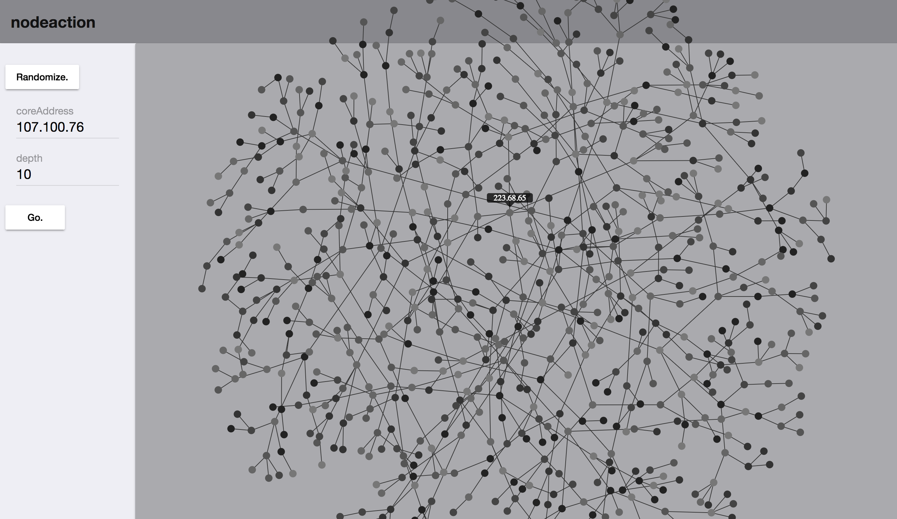

# Neo4j to Angular4 (and ngx-charts)


## What is this?



Beyond an exercise in personal education — there were chunks of tech in here I hadn't even heard of — this is a db to pixel gizmo which integrates

- [Neo4j](https://neo4j.com/) a [graph database](https://en.wikipedia.org/wiki/Graph_database) using [Cypher query language](https://neo4j.com/developer/cypher-query-language/)
- [NodeJS](https://nodejs.org/en/), [Express](http://expressjs.com/)
- [Angular4](https://angular.io/), [Material Design](https://material.angular.io/)
- [ngx-charts](https://github.com/swimlane/ngx-charts) for the force directed graph

Still in progress, this exercise focuses more on the backend.


---

## My Favorite Bit of Code

The database seeds with 100k records, each seed a random IP address with 3 random connections.

In the graph db, this gets `UNWIND`-ed (`UNWOUND`?) via **Cypher query language**.

```
let queryString = 'WITH {_seeds} AS seeds';
queryString += ' UNWIND seeds as seed';
queryString += ' MERGE (source:Address { address: seed.address })';

queryString += ' WITH source, seed.connections AS connections';
queryString += ' UNWIND connections AS connection';
queryString += ' MATCH (target:Address) WHERE target.address = connection';

queryString += ' MERGE (source)-[:CONNECTS_TO]->(target)';
```

This also proved a challenge where I missed a key bit until @InverseFalcon helped me via StackOverflow: [UNWIND with child UNWIND producing wrong nodes and relationships](http://stackoverflow.com/questions/43590633/unwind-with-child-unwind-producing-wrong-nodes-and-relationships/43592039#43592039)

Despite watching a series of videos and reading the docs repeatedly I never ran across this:

> The `WITH` statement creates its own, new scope.

My original version missed `' WITH **source,** seed.connections AS connections';` and had me stumped until @InverseFalcon chimed in. I had tried other versions of passing in a var to the `UNWIND` loop, but kept bonking.

I really wanted the UNWIND and child UNWIND all in one place rather than seeding parents then adding all the connections afterward.


---

## TODO

- [X] update README - part 1
- [ ] update README - part 2
- [ ] get the Swagger spec wired all proper-like
- [ ] tests, tests, tests
- [ ] improve Docker bits
- [ ] audit and update the todos


---


### Random Add and Remove Nodes

1) Every 5 seconds add 10 new random nodes with connections are added.
2) Every 10 seconds delete 5 random nodes and relationships.

run: `node ./src/neo/neo-db-randomizer.js`


### Seed the DB with 100k Records
`node ./src/neo/neo-db-seeder.js`


---

# Nodeaction

This project was generated with [Angular CLI](https://github.com/angular/angular-cli) version 1.0.0.

## Development server

Run `ng serve` for a dev server. Navigate to `http://localhost:4200/`. The app will automatically reload if you change any of the source files.

## Code scaffolding

Run `ng generate component component-name` to generate a new component. You can also use `ng generate directive/pipe/service/class/module`.

## Build

Run `ng build` to build the project. The build artifacts will be stored in the `dist/` directory. Use the `-prod` flag for a production build.

## Running unit tests

Run `ng test` to execute the unit tests via [Karma](https://karma-runner.github.io).

## Running end-to-end tests

Run `ng e2e` to execute the end-to-end tests via [Protractor](http://www.protractortest.org/).
Before running the tests make sure you are serving the app via `ng serve`.

## Further help

To get more help on the Angular CLI use `ng help` or go check out the [Angular CLI README](https://github.com/angular/angular-cli/blob/master/README.md).


